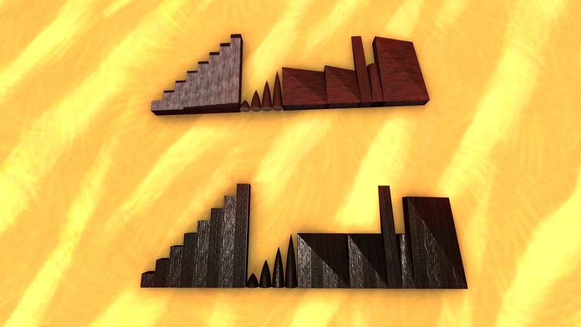

FTD Refit
=========

Performs one or more material remapping operations on a blueprint, with support
for Mega Slopes Pack 1 and 2.



Prerequisites
-------------
* Python 3.8+ (not tested on older Python 3.x versions)
* Change `vanilla_path_base` to point to your 
  `From_The_Depths_Data/StreamingAssets/Mods/Core_Structural` directory
  in your FTD install dir
* Change `mod_base` to point to your `From The Depths/Mods` directory

You do not need Mega Slopes Pack installed or available, but the tool will do
the right thing automatically if it's installed.

Why
---
The built-in Armor Refit tool has a few problems:

* You need resources nearby to do the refit (inconvenient and frequently
  confusing), having commodities or creative mode is not enough.
* Only one operation at a time.
* Having extra block packs installed can **horribly break** the built-in tool,
  with no feedback provided on how or why. Brilliant Skies confirms they have no
  intent to ever address this.

Usage
-----
```
python3 refit.py [-h] [-f] input_blueprint output_blueprint [op [op ...]]
```

If you want to overwrite the `input_blueprint`, specify the `output_blueprint`
as the same path as the `input_blueprint` and provide the `-f` flag.
(WARNING: We do not follow symlinks or hardlinks, and will not save you from
yourself in that case!)

Each `op` is a string of the form `X[c]Y[d]`, where `X` and `Y` are single 
letters corresponding to the source and destination material, and `c` and `d`
are integers corresponding to the source and destination color. Omitting `c`
results in all source blocks regardless of color being transformed, and omitting
`d` results in all blocks retaining their original color.

If multiple `op`s are provided, they are applied in the order they appear on the
command line.

Blocks that can't be remapped according to an `op` will be untouched, and a
notice emitted to the terminal.

Valid values for `X` and `Y`:

* `W` (wood)
* `S` (stone)
* `A` (alloy)
* `M` (metal)
* `H` (heavy armour)
* `G` (glass)
* `R` (rubber)
* `L` (lead)

Examples:

* `WA` turns all wood blocks into alloy blocks.
* `A1M` turns all color-1 alloy blocks into metal blocks.
* `MH2` turns all metal blocks into heavy armor blocks, recoloring them
  to color 2.
* `A1M2` turns all color-1 alloy blocks into color-2 metal blocks.

Example usage
-------------

```
python3 refit.py foo.blueprint bar.blueprint A0W A2M A3H4
```
would turn all color-0 alloy blocks into wood, all color-2 alloy blocks into
metal, and all color-3 alloy blocks into color-4 heavy armour.

Adding support for other mods
-----------------------------
Add an appropriate `load_files` invocation for the ItemDups and the meshes.
Load ItemDups into `blocks` dictionary and meshes into `meshes` dictionary.

Note that, for remapping to work, each ItemDup for a remappable structural block
must duplicate the basic cube block of the corresponding material (e.g. the
vanilla 1x1x1 cube block called "Wood Block"), and each material variant of a
shape must refer to the *exact* same mesh.

License
-------
Apache 2.0 (see LICENSE, or explainer [here](https://choosealicense.com/licenses/apache-2.0/)).